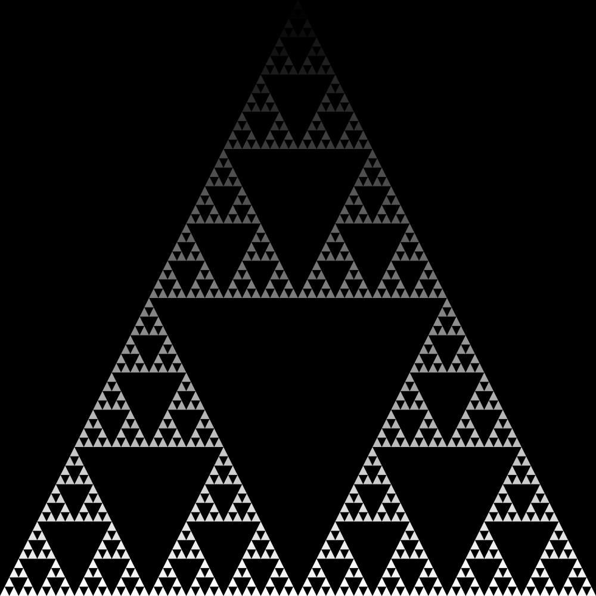
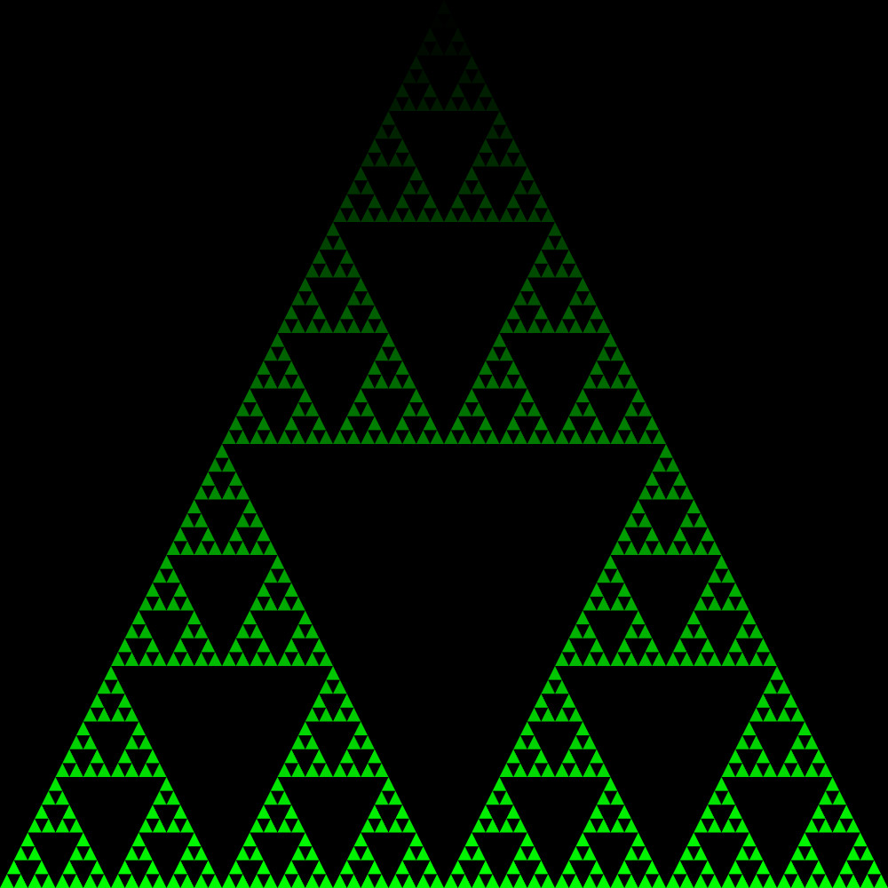
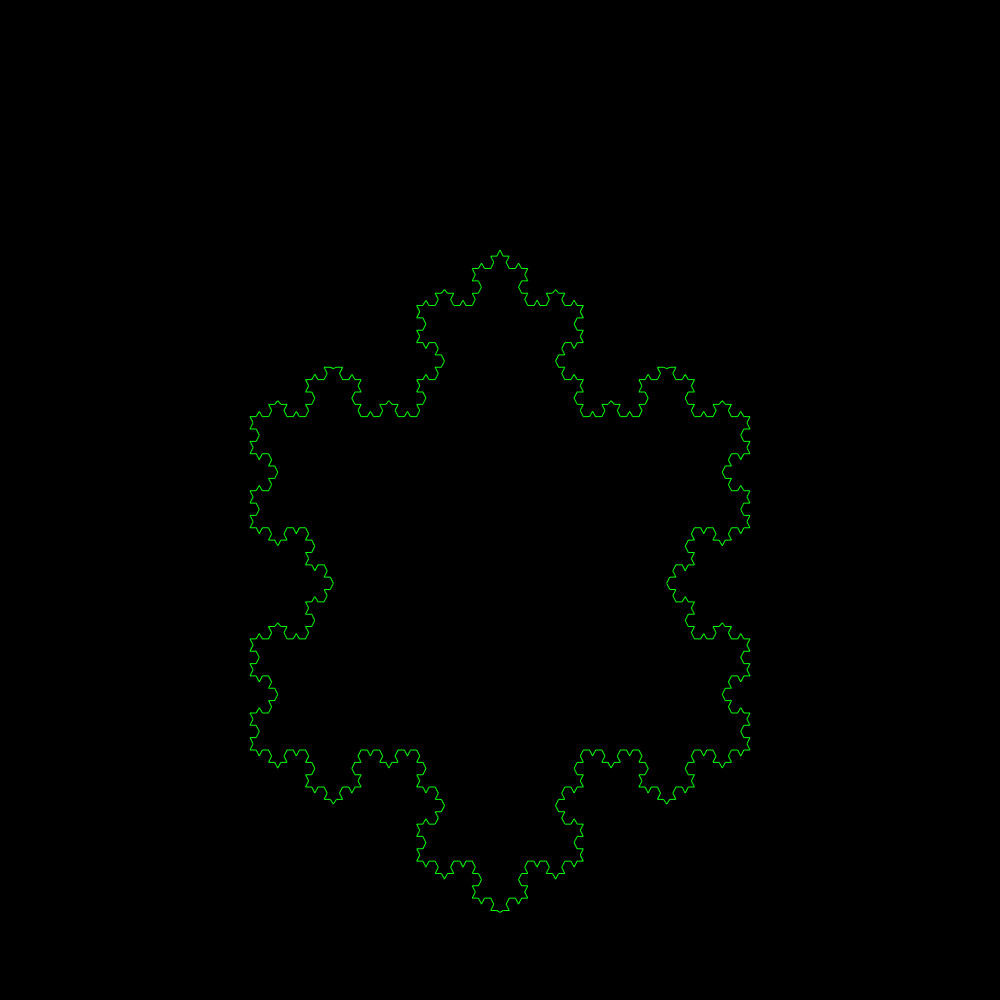
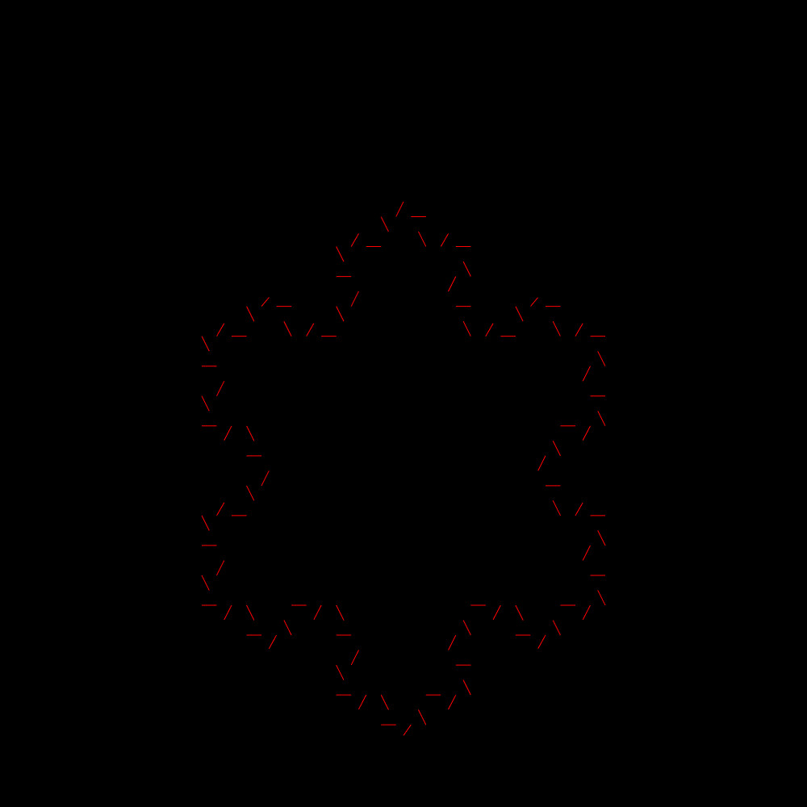
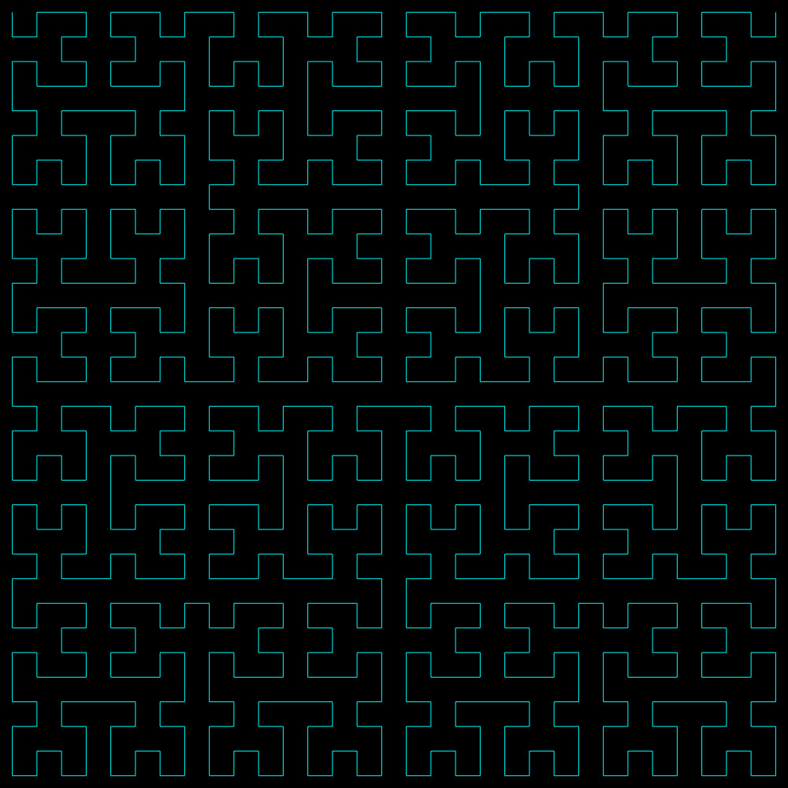
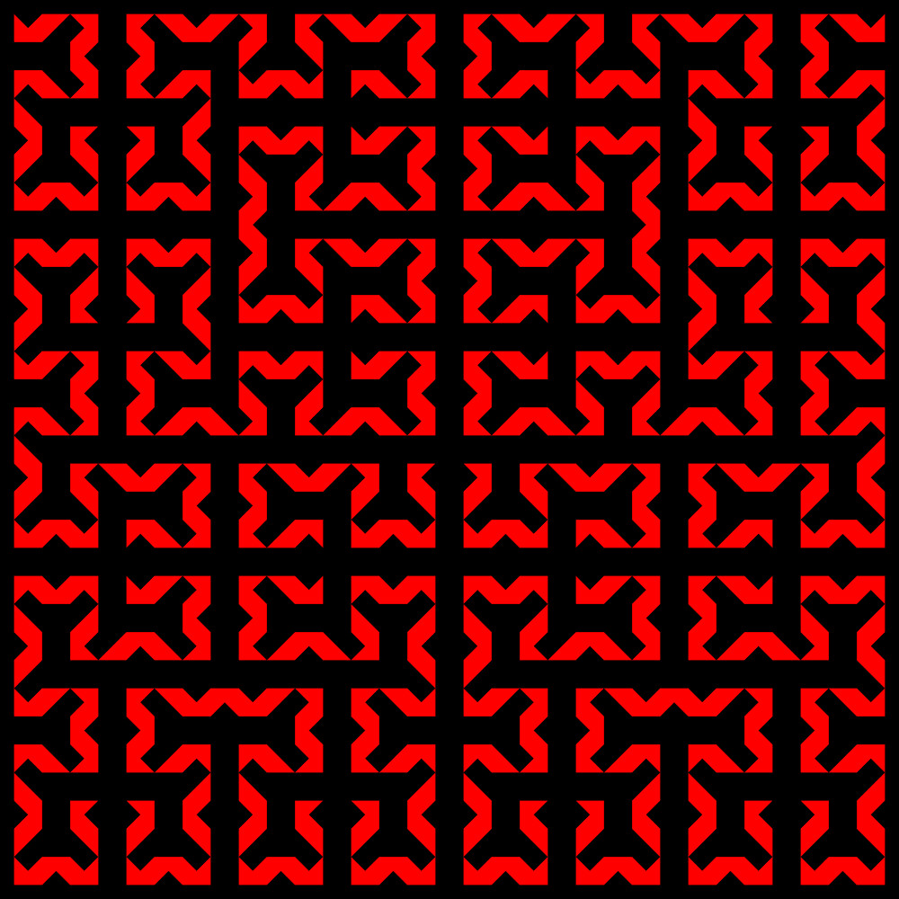
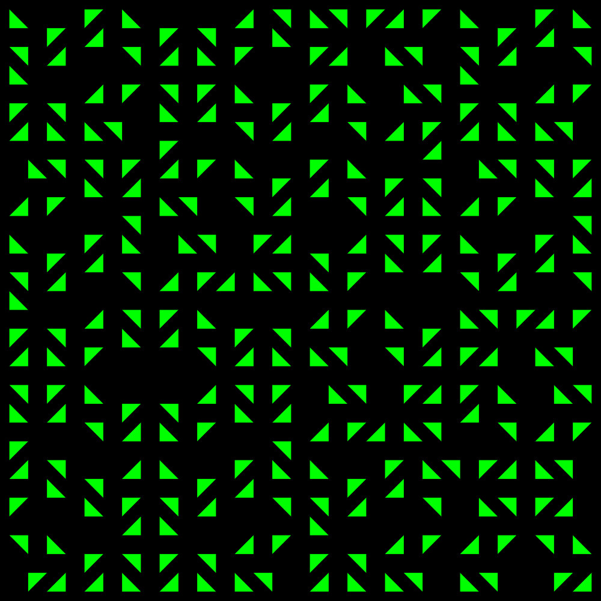
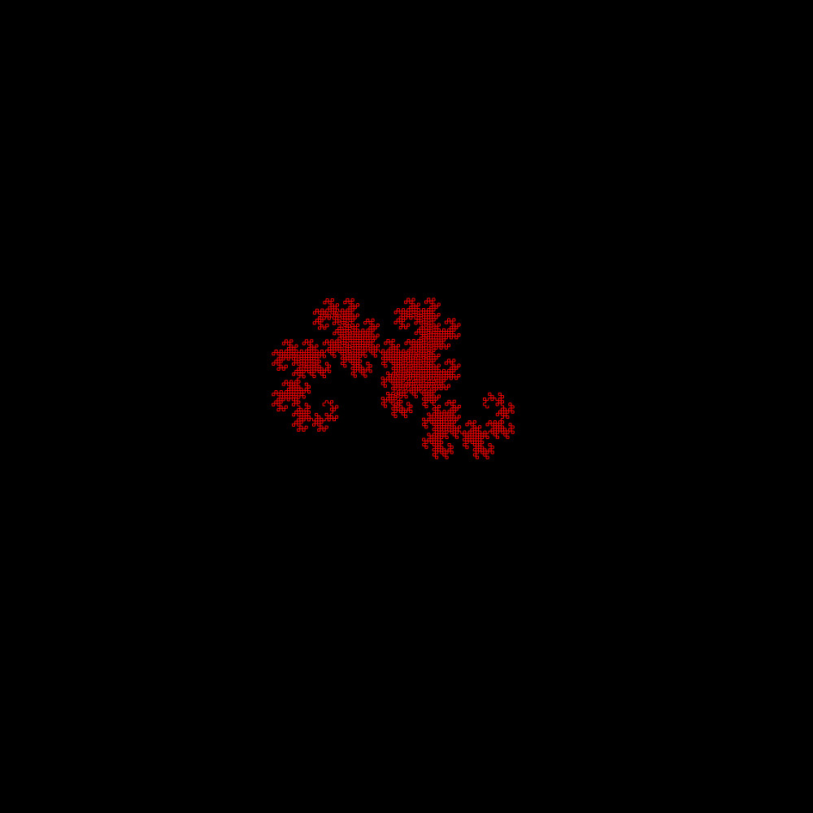
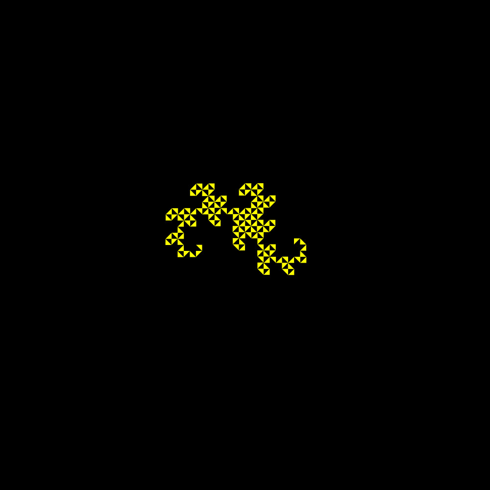
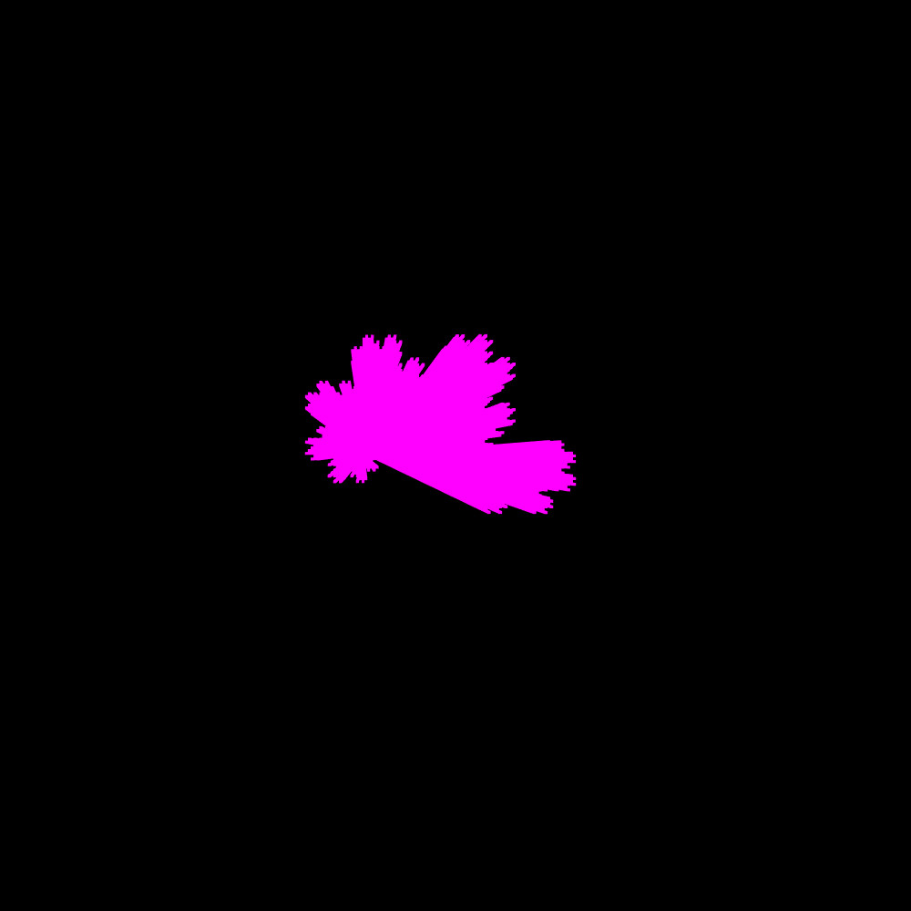

# CSC 212 Final Group Project: Recursive Graphics (Fractals)
*Created by Dylan Chelo, Mason Jacob, and Nick Powers*

## Overview
This project uses the SFML Library to create an interative program that generates recursive graphics. Users interact with the program using keystrokes, to create the following fractals:
1. Sierpinski's Triangle
2. Koch's Snowflake
3. Hilbert's Curve
4. Dragon's Curve

## Setup

This program is mainly tested on Ubuntu, as it uses the Linux version of the SFML Library installed directly into the libraries folder of this repository.

### Prerequisites

1. **Install g++**

` sudo apt-get update `

` sudo apt-get install g++ `

2.  **Install SFML library (Optional)**

The SFML Library is currently installed in this repository, so there is no need to download and configure for yourself. However, as libraries are very finicky, below are instructions for three ways to install it if you run into issues using our repo version:

* Using package manager

$ sudo apt-get install libsfml-dev

* Download the SDK

Download the SDK from the [download page](https://www.sfml-dev.org/download.php), unpack it and copy the files to your preferred location: either a separate path in your personal folder (like /home/me/sfml), or a standard path (like /usr/local).

* Building SFML yourself

If you want to go this way, there's a [dedicated tutorial](https://www.sfml-dev.org/tutorials/2.0/compile-with-cmake.php) on building SFML yourself.

## Compile and Run
1. Clone this repository
3. Type 'make' in your terminal (without quotes)
4. Type './generator.out' in your terminal (also without quotes)
5. Read the Menu screen for instructions on how to use the generator

# Gallery:
## Sierpinski Triangle:

------------------------------------------------------------
## Koch's Snowflake:

------------------------------------------------------------
## Hilbert's Curve:

------------------------------------------------------------
## Dragon's Curve:

------------------------------------------------------------
